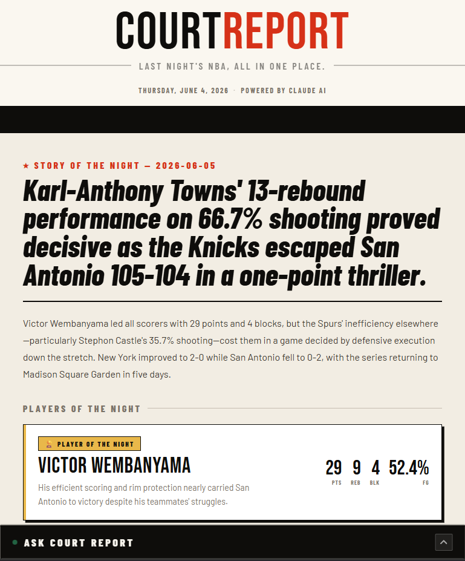

# Court Report

A RAG-powered NBA morning digest built with LangChain, Chroma, and the Claude API.



---

## What It Does

Court Report fetches last night's NBA box scores every morning, enriches them with player stats, retrieves historical context from a vector database, and generates a structured digest using Claude. Users can then ask follow-up questions about last night's games via a built-in chat interface.

The digest includes:

- **Story of the Night** — the single most dramatic moment and broader context
- **Players of the Night** — top performer by Game Score + most underrated performer by impact differential
- **By the Numbers** — 4 standalone stats that tell the story numbers alone can't
- **Watch Next** — the one upcoming game worth watching with series context
- **Ask Court Report** — chat interface for follow-up questions powered by RAG

---

## How It Works

```
nba_api (ScoreboardV3 + BoxScoreTraditionalV3)
     ↓
Raw box scores + full player stats
     ↓
Game Score calculation (Hollinger formula) + Underrated Player detection
     ↓
Chroma vector store retrieval (historical recaps + season averages)
     ↓
Claude API generates structured digest
     ↓
FastAPI serves digest as JSON
     ↓
React frontend displays digest + chat interface
     ↓
Results stored in Chroma for future RAG retrieval
```

---

## Tech Stack

| Tool | Purpose |
|------|---------|
| **nba_api** | Fetches live NBA box scores and player stats — free, no API key needed |
| **Anthropic Claude API** | Generates digest narrative and powers chat responses |
| **LangChain** | Chroma vectorstore wrapper and retrieval chain |
| **Chroma** | Local vector database storing game recaps, player stats, and season averages |
| **FastAPI** | Backend API serving digest as JSON with 12-hour caching |
| **React + Vite** | Frontend dashboard displaying digest and chat interface |
| **sentence-transformers** | all-MiniLM-L6-v2 embedding model for semantic search |

---

## Chroma Document Types

The vector store contains three document types:

- **game_recap** — narrative summaries of past games for historical context
- **player_game** — per-player stat lines for every player who played last night (5+ minutes)
- **season_averages** — 2025-26 season averages for top 50 NBA players by scoring

---

## Setup

### Prerequisites

- Python 3.11+
- Node.js 18+
- Anthropic API key (get one at [console.anthropic.com](https://console.anthropic.com))

### Installation

```bash
git clone https://github.com/arvindshastri/court-report
cd court-report
python -m venv venv
venv\Scripts\activate  # Windows
pip install -r requirements.txt
```

Add your API key to `.env`:

```
ANTHROPIC_API_KEY=your_key_here
```

Seed season averages (run once):

```bash
python scripts/seed_season_averages.py
```

### Running the App

**Terminal 1 — start the backend:**

```bash
uvicorn server:app --reload
```

**Terminal 2 — start the frontend:**

```bash
cd court-report-ui
npm install
npm run dev
```

Open [http://localhost:5173](http://localhost:5173)

### Running the Eval Suite

```bash
python evals/scorer.py
```

Results are saved to `evals/results/eval_<timestamp>.txt`

---

## Eval Results

The project includes an LLM-as-Judge eval suite with 16 golden test cases covering:
blowouts, overtime games, comeback stories, player bad nights, single-game nights, multi-game slates, playoff series context, Game 7s, historic performances, hallucination checks, format compliance, and filler phrase detection.

**Average score: 94/100 across 16 test cases.**

Notable findings:

- **Hallucination check: 100/100** — Claude correctly refuses to invent stats when data is missing
- **Format compliance: 83/100** — occasional By the Numbers bullets exceed 20-word limit
- **Multi-game synthesis: 100/100** — correctly synthesizes 15-game nights into key storylines

---

## Roadmap

Planned features include play-by-play integration, quarter scores display, player headshots, and Pinecone cloud migration.

---

*Built by Arvind Shastri — June 2026*
